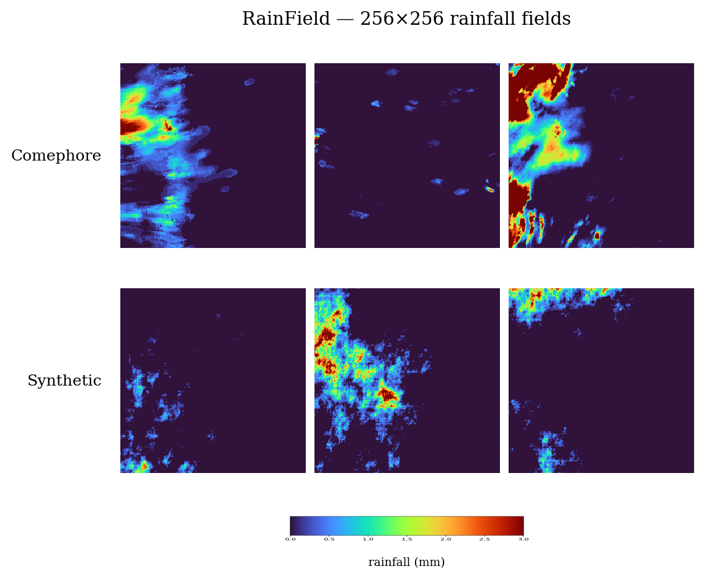

<h1 align="center">Heavy-tailed High-dimensional Precipitation Benchmark</h1>

  <b>A heavy-tailed, precipitation-centered benchmark for deep generative models.</b> 
  Shared datasets, generative and statistical baselines, and extreme-value metrics
  for high-dimensional spatial rainfall.

  
  
  
  

---

## What is this?

Simulating extreme events in high-dimensional, heavy-tailed spatial fields — precipitation being
the leading example — is a central challenge in the geosciences. Deep generative models are a
promising alternative to classical spatial statistics, but the literature is fragmented: methods
are evaluated on different data and metrics, and rarely against a common statistical baseline.

This project builds a **reproducible benchmark centered on precipitation**, designed to compare
generative models specifically on their ability to reproduce *tail* behaviour, not just overall
fidelity. It brings together:

- **two complementary datasets** — a *real* one derived from Météo-France COMEPHORE radar
  reanalysis, and a *synthetic* one with controllable tail behaviour and dependence structure,
  providing an exact ground truth the real data cannot offer;
- **several families of generative baselines** — spanning diffusion, normalizing flows, GANs and
  VAEs — together with a classical spatial-statistics baseline;
- **extreme-value metrics** targeting tail heaviness, the geometry of extremes, and asymptotic
  (co-exceedance) dependence, each read against a reference-based noise floor.

  
   
  <i>Real hourly rainfall fields from the COMEPHORE Massif-Central crop (256&times;256, 1&nbsp;km)
  and the synthetic dataset. Shared colour scale in mm.</i>

---

## Scale & engineering

The benchmark is built on a unified training / generation / evaluation pipeline (PyTorch +
PyTorch Lightning), with every model trained unconditionally on the same 256×256 fields and every
sampler writing in physical units (mm) so that all methods are directly comparable.

- **Real data:** COMEPHORE hourly radar reanalysis (Météo-France), a 256×256 / 1 km crop over the
  Massif Central, 2006–2026, ~1.5×10⁵ wet-hour frames.
- **Compute:** trained on the IDRIS **Jean Zay** cluster (NVIDIA A100 / H100), single-GPU and
  multi-GPU (DDP).
- **Reproducibility:** fixed seeds for initialisation, shuffling and splits; resumable, per-batch
  seeded generation.

---

## Datasets

Both datasets are stacks of single-channel `[N, 1, 256, 256]` rainfall images in millimetres.

**Real — COMEPHORE.** Hourly precipitation reanalysis from Météo-France (radar network merged with
rain gauges). The raw archive is publicly available as open data on
[meteo.data.gouv.fr](https://meteo.data.gouv.fr) under the *Etalab Open Licence 2.0*. Turning the
raw archive into model-ready tensors requires a non-trivial preprocessing pipeline.

**Synthetic.** A stationary, position- and tail-aware rainfall model fitted to COMEPHORE, then
sampled with a controlled dependence structure. Because the generator is known by construction, the
tail behaviour and dependence give an exact ground truth for evaluation.

---

## Status

This is an ongoing research project; the paper is in preparation. The full code, processed datasets
and preprocessing pipeline will be released upon publication.

---

## Author

**Tiziano Fassina** — PhD student, PSL (Mines Paris) & Sorbonne Université.
[LinkedIn](https://linkedin.com/in/tiziano-fassina) · [GitHub](https://github.com/tizianofassina)
